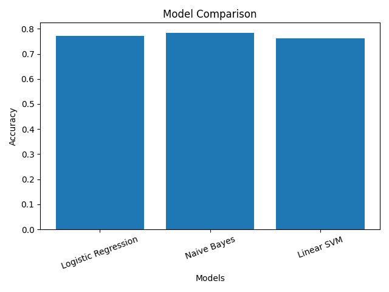

# Sentiment Analysis using NLP
# Overview

This project presents an end-to-end sentiment analysis pipeline using techniques from Natural Language Processing (NLP) and machine learning. The objective is to classify short text samples into positive, negative, and neutral sentiment categories, with a particular focus on linguistic preprocessing and feature-based modeling.

The project is designed as an academic demonstration of how linguistic theory and computational methods can be integrated within a data science workflow. It explores the relationship between language structure, meaning, and machine learning classification through practical NLP implementation in Python.

---

# Research Motivation

Sentiment analysis is a fundamental task in Natural Language Processing, widely used in applications such as social media monitoring, product reviews, and customer feedback analysis. Understanding human emotions and opinions from text is essential for decision-making in both academic and industrial contexts.

This project is motivated by the intersection of linguistics and machine learning, focusing on how linguistic preprocessing techniques such as lemmatization, stopword removal, and normalization can enhance the performance of traditional classification models.

Rather than relying solely on complex deep learning architectures, this work explores how well-structured linguistic features combined with classical machine learning algorithms can achieve meaningful and interpretable results. The goal is to bridge the gap between raw textual data and structured insights through efficient and explainable NLP methods.

---

# Dataset

The dataset used in this project consists of short English text samples labeled into three sentiment categories: positive, negative, and neutral. It is derived from publicly available sentiment analysis datasets and adapted for experimental and educational purposes.

The final dataset contains approximately 6,900 labeled instances. Each sample represents a short sentence or phrase expressing an opinion or emotional tone, making it suitable for supervised classification tasks.

To ensure consistency and model compatibility, the dataset was preprocessed using linguistic techniques including text normalization, lowercasing, noise removal, and lemmatization. Stopwords and punctuation were also removed to retain only meaningful lexical features.

It is important to note that this dataset is relatively small and may not fully capture the complexity of real-world language, such as sarcasm, contextual ambiguity, or domain-specific expressions. Therefore, the results should be interpreted as a demonstration of methodology rather than large-scale production performance.

# Tools & Libraries

* Python
* spaCy (linguistic preprocessing)
* NLTK
* Scikit-learn
* Pandas
* NumPy
* Matplotlib / Seaborn (visualization)

---

# Methodology

This project follows a structured Natural Language Processing (NLP) pipeline combining linguistic preprocessing with classical machine learning models for sentiment classification.

### Text Preprocessing

Raw text data was normalized to improve consistency and reduce noise. The preprocessing steps include:

- Lowercasing all text  
- Removing non-alphabetic characters and punctuation  
- Tokenization using spaCy  
- Lemmatization to reduce words to their base forms  
- Removal of stopwords to retain meaningful lexical features  

These steps help transform unstructured text into a clean and linguistically meaningful representation.

### Feature Extraction

The processed text was converted into numerical features using TF-IDF (Term Frequency–Inverse Document Frequency) vectorization. This approach captures the relative importance of words across the dataset.

- N-gram range: (1,2), including unigrams and bigrams to capture both individual word importance and short contextual phrases
- Maximum features: limited to control dimensionality  

This ensures a balance between expressiveness and computational efficiency.

### Model Training

Three classical machine learning models were implemented and compared:

- Logistic Regression (robust and interpretable)  
- Multinomial Naive Bayes (efficient for text classification)  
- Linear Support Vector Machine (effective in high-dimensional spaces)  

The dataset was split into training and testing sets using an 80/20 ratio with a fixed random state for reproducibility.

### Evaluation

Model performance was evaluated using:

- Accuracy score  
- Confusion matrix for class-wise analysis  

This allows a better understanding of misclassification patterns across sentiment classes.

## Model Performance



### Design Choice

Instead of deep learning approaches, this project emphasizes interpretable and computationally efficient models. The goal is to demonstrate how effective linguistic preprocessing combined with classical machine learning can be for sentiment analysis tasks.

---

# Linguistic Relevance

This project incorporates key linguistic principles to enhance sentiment analysis through structured text processing.

Lemmatization is used for morphological normalization, reducing inflected forms of words to their base representations. For example, words like “running”, “ran”, and “runs” are all mapped to “run”, allowing the model to treat them as the same semantic unit and avoid redundancy.

The use of n-grams (unigrams and bigrams) enables the model to capture both individual word meanings and short contextual patterns. For instance, the word “good” alone conveys positive sentiment, but the phrase “not good” reverses that meaning. Bigrams help capture such contextual relationships that single words may miss.

Stopword removal focuses the analysis on content-bearing words. Words like “the”, “is”, and “and” are removed because they do not contribute meaningful sentiment, whereas words like “amazing”, “terrible”, or “boring” carry strong emotional weight.

Overall, the approach demonstrates how linguistic structure—morphology, lexical meaning, and local context—can directly support machine learning models in extracting meaningful patterns from text.

---

# Project Structure

```plaintext
sentiment-analysis-nlp/
├── data/                  # Dataset files
├── notebooks/             # Jupyter notebooks
│   └── sentiment_analysis_intermediate.ipynb
├── src/                   # Source code modules
├── requirements.txt       # Project dependencies
├── README.md              # Project documentation
└── LICENSE
```

---

# Limitations

## Limitations

This project is designed as a controlled experimental study, prioritizing methodological clarity over production-scale performance.

- **Dataset Scale and Diversity**  
  The dataset (~6,900 samples) is relatively small and may not capture the full variability of real-world language, potentially limiting generalization.

- **Contextual Understanding**  
  The TF-IDF representation treats text as independent tokens and does not model deeper contextual relationships or long-range dependencies.

- **Handling of Complex Language Phenomena**  
  The model has limited ability to interpret sarcasm, irony, or context-sensitive sentiment expressions.

- **Model Complexity**  
  The use of classical machine learning models favors interpretability and efficiency but may underperform compared to modern deep learning approaches in complex scenarios.

Overall, these limitations reflect a deliberate design choice to emphasize interpretability, linguistic preprocessing, and foundational NLP techniques.

---

# Future Work

Future extensions of this project may include:

* Sentiment analysis for Urdu and Urdu-English code-mixed text
* Transformer-based architectures such as BERT
* Multilingual NLP pipelines
* Comparative linguistic analysis across dialects and regional English varieties
* Larger real-world social media datasets
* Deep learning approaches for contextual semantic analysis

These directions would further strengthen the intersection between linguistics, artificial intelligence, and data science research.

---

# Conclusion

This project demonstrates how linguistic preprocessing techniques can be effectively combined with classical machine learning models to perform sentiment analysis on textual data.

The results show that even with a relatively simple pipeline based on TF-IDF features and traditional classifiers, meaningful performance can be achieved. The integration of linguistic concepts such as lemmatization and phrase-level analysis further enhances the model’s ability to capture sentiment-related patterns.

Rather than focusing on complex deep learning architectures, this work highlights the value of interpretable and computationally efficient approaches. It emphasizes that well-structured preprocessing and feature engineering remain critical components of successful NLP systems.

Overall, this project reflects the intersection of linguistics and data science, demonstrating how theoretical insights can be translated into practical machine learning applications.
